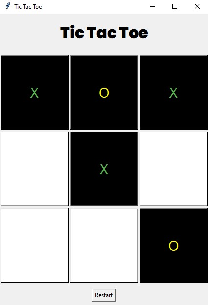

# Tic Tac Toe ❌⭕ (Tkinter Edition)

A simple, fun, and colorful Tic Tac Toe game built with Python's Tkinter library!  
Enjoy classic gameplay with a modern look, including vibrant button colors and a stylish Poppins font.

## 🎮 Features

- Two-player Tic Tac Toe game
- Beautiful GUI using Tkinter
- Dynamic color changes for X and O
- "Restart" button for quick replays
- Win and draw detection with popup alerts

## 🖥️ Screenshots

<!-- Add your screenshot here -->


## 🚀 Getting Started

### Prerequisites

- Python 3.x

### Installation

1. **Clone the repository**  
   ```bash
   git clone https://github.com/yourusername/tic-tac-toe
   cd tic-tac-to
   ```

2. **(Optional) Install custom font**  
   For best appearance, install the [Poppins font](https://fonts.google.com/specimen/Poppins) on your system.

### Run the Game

```bash
python tictactoe.py
```

## ✨ How to Play

- Player X and Player O take turns clicking on the board to mark their symbol.
- The first to align three symbols (row, column, or diagonal) wins!
- Click **Restart** to play again.

## 📦 File Structure

```
tictactoe.py       # Main game script
README.md          # This file
screenshot.png     # (Optional) Screenshot of the game
```

## 🤝 Contributing

Contributions are welcome!  
Feel free to open an issue or pull request to suggest improvements.

## 📄 License

This project is open source and available under the [MIT License](LICENSE).

---

Enjoy playing! ❌⭕🕹️
